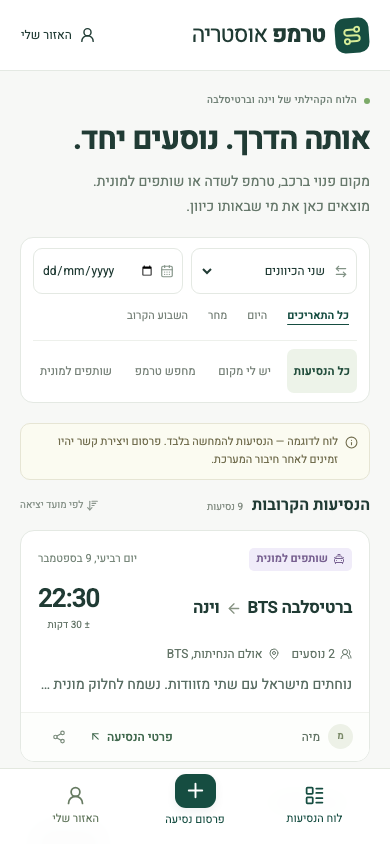

# טרמפ אוסטריה · Tremp Austria

A free, open-source community ride board between Vienna and Bratislava Airport. Browse in Hebrew, offer spare seats, find a ride, or coordinate a shared taxi. Personal contact details become available only after a contact request is accepted.

This community board does not provide transport, employ drivers, arrange payments or determine fares. Participants make their own arrangements.

**App:** [tremp-austria.vercel.app](https://tremp-austria.vercel.app) · **Source:** [llirik/tremp-austria](https://github.com/llirik/tremp-austria) · **License:** [MIT](LICENSE)

**Deployment status:** the app is deployed on Vercel, with a healthy Supabase project in Frankfurt and both migrations applied. The hosted authentication backend works. Community email delivery still requires a verified sending domain and custom SMTP: Supabase's default email service only delivers to project team addresses. See [its SMTP documentation](https://supabase.com/docs/guides/auth/auth-smtp).

## Features

- Public browsing, direction/date/type filters, stable `/ride/<id>` links and Hebrew WhatsApp sharing.
- **יש לי מקום** — spare seats; **מחפש טרמפ** — looking for a ride; **שותפים למונית** — sharing a taxi.
- Email magic-link authentication when creating listings or requesting contact. Onboarding asks for a display name and one private contact method: WhatsApp, Telegram or email.
- Personal listings, editing, cancellation, received/sent contact requests, acceptance, rejection and revocation.
- Potential matches based on direction, departure flexibility, listing type and seats.
- Mobile layouts, Hebrew RTL, Vienna/Bratislava local times and accessible native forms.

There are no maps, live flight data, internal chat or payments. Optional flight numbers are stored separately from public notes.



Screenshots use synthetic local demo listings. [View the desktop layout](docs/images/desktop-board.png). Production contains only community-submitted listings.

## Architecture

SvelteKit and TypeScript provide server-rendered pages and form actions. The UI uses Svelte 5, Tailwind CSS 4, Lucide and a locally bundled Heebo font. Supabase provides PostgreSQL and Auth. The Vercel adapter targets Node.js 24 in Frankfurt (`fra1`); there is no separate backend service.

```text
Browser → SvelteKit loads/form actions → Supabase Auth + PostgreSQL
                                            ├─ public_rides projection
                                            ├─ owner-scoped tables with RLS
                                            └─ consent-checked contact RPCs
```

| Path                         | Responsibility                                               |
| ---------------------------- | ------------------------------------------------------------ |
| `src/lib/domain.ts`          | Types, ride validation, matching, sharing and time handling  |
| `src/lib/components/`        | Ride cards, short forms and share actions                    |
| `src/lib/server/`            | Auth boundaries, explicit projections and contact validation |
| `src/hooks.server.ts`        | Supabase SSR cookies, verified users and security headers    |
| `src/routes/`                | Board, detail pages, authentication and account actions      |
| `supabase/migrations/`       | Schema, privileges, RLS, consent RPCs and validation         |
| `supabase/tests/run-rls.mjs` | PostgreSQL authorization regression suite                    |

Hebrew is the initial language. Shared labels and formatting helpers are isolated in `domain.ts`; English translation remains future work.

## Local development

Use **Node.js 24** and the **pnpm version in `package.json`**.

```sh
git clone https://github.com/llirik/tremp-austria.git
cd tremp-austria
pnpm install --frozen-lockfile
cp .env.example .env
pnpm dev
```

Open `http://localhost:5173`. Without Supabase credentials, the development server shows a clearly labeled, read-only demonstration with synthetic Hebrew listings. It cannot create accounts, save rides or send contact requests.

For a working local backend, install the [Supabase CLI and a Docker-compatible runtime](https://supabase.com/docs/guides/local-development/cli/getting-started), then run:

```sh
supabase start
supabase db reset
supabase status
```

`db reset` rebuilds the **local** database and loads `supabase/seed.sql`, discarding existing local data. Copy the local API URL and publishable key from `supabase status` into `.env`, keep demo mode false, and restart the app. Local sign-in messages appear in the mail viewer at `http://localhost:54324`; open the magic link in the same browser that requested it.

Seed data covers both directions, all listing types, potential matches, full vehicles, flexible departures, past rides and cancellations. Synthetic profiles use reserved `.invalid` contacts and have no passwords or usable identities. Create a local account through the app to test authenticated actions.

### Environment

| Variable                          | Purpose                                                                              |
| --------------------------------- | ------------------------------------------------------------------------------------ |
| `PUBLIC_SUPABASE_URL`             | Local or hosted Supabase API origin                                                  |
| `PUBLIC_SUPABASE_PUBLISHABLE_KEY` | Publishable key; legacy `PUBLIC_SUPABASE_ANON_KEY` is also supported                 |
| `PUBLIC_SITE_URL`                 | Canonical app origin; `http://localhost:5173` locally                                |
| `PUBLIC_DEMO_MODE`                | `false` for real environments; `true` only for an intentional, labeled demonstration |

The application never needs a service-role key. Keep database passwords, management tokens and SMTP credentials out of the repository and every `PUBLIC_` variable. `.env` and provider CLI state are ignored by Git.

Production does **not** substitute demo data when configuration or database access fails. Keep `PUBLIC_DEMO_MODE=false`; an empty production board means nobody has posted yet.

## Privacy and authorization

Four application tables—`profiles`, `rides`, `private_contacts`, and `contact_requests`—plus private rate counters all use RLS. Anonymous clients read only `public_rides`, an explicit projection of active listings and display names. It excludes auth IDs and contact details. Direct profile and ride-table reads are limited to their owner.

Contact RPCs derive participants from the authenticated session and ride. Only the owner can accept or reject a pending request. An accepted relationship allows the pair to query each other's private contact. These permissions are enforced by PostgreSQL even when a client bypasses the UI. See [the database contract](supabase/README.md).

Either participant can revoke an individual request; another accepted request between the pair still grants access. Cancelling a listing hides it publicly but preserves accepted relationships. Deleting a ride at the database level removes its requests. Previously copied details cannot be recalled. The UI supports cancellation; account deletion currently requires an operator.

Public fields reject obvious emails, phone-like strings, links and non-whitespace controls. This cannot reliably identify exact addresses or disguised contact details; users should enter approximate areas. Database limits allow 12 rides/hour and 30/day, and 20 contact requests/hour and 50/day per account. Deleting content does not reset the counters.

Sessions use server-managed cookies and Supabase `getUser()` verification. Public page data never serializes an Auth user, email or account UUID. The app includes no analytics or location tracking integration.

Before wider use, the operator must supply a real operator identity and privacy/support contact in the privacy page, establish deletion and abuse-report processes, and verify SMTP delivery. These details are deliberately not invented.

## Matching and lifecycle

`isPotentialMatch()` and `potentialMatches()` in `src/lib/domain.ts` implement the isolated algorithm:

1. Listings must differ, be active and have the same direction.
2. Drivers and passengers match when enough seats are available; taxi-share listings match other taxi shares.
3. Finite windows overlap when the departure difference is no greater than the sum of both flexibility windows. “Flexible” means the same `Europe/Vienna` calendar day.

Matches are suggestions, not reservations. Detail pages compare against upcoming candidates. The default feed filters out past departures without a cron job. A past active listing keeps its shareable detail page but cannot receive new requests. Owners can see their historical and cancelled entries.

Timestamps use `timestamptz`; forms interpret input in `Europe/Vienna`. Ambiguous or nonexistent times during daylight-saving transitions are rejected for clarification.

## Checks

```sh
pnpm check       # Svelte/TypeScript
pnpm lint        # ESLint
pnpm test        # Matching, validation, redirects and auth-boundary unit tests
pnpm test:db     # Actual PostgreSQL grants, RLS, RPC and constraint checks via PGlite
pnpm build      # Production build
pnpm validate   # All five checks above; also runs in GitHub Actions
```

The database harness applies every migration and the seed to a fresh PostgreSQL engine. It supplies Supabase's Auth role/identity primitives and exercises the actual policies. Its 70 checks cover public projections, impersonation, immutable ownership, consent, revocation, deletion, validation and persistent rate limits. No hosted credentials or Docker daemon are needed.

For browser smoke tests, run `pnpm exec playwright install chromium`, then `pnpm test:e2e`. Visually inspect Hebrew RTL at approximately 390×844, 430×932 and 1440×900 after interface changes. The initial release passes 36 unit tests, 70 database checks and 6 browser tests. A separate two-account browser check against hosted Supabase passed profile creation, listing creation/editing/cancellation, contact request/acceptance/revocation, anonymous privacy and unauthorized-edit checks; its temporary accounts and data were deleted. SMTP magic-link delivery to non-team addresses remains blocked until custom SMTP is configured.

## Deploying a fork

Create a Supabase project and apply the committed migrations:

```sh
supabase login
supabase link --project-ref YOUR_PROJECT_REF
supabase db push
```

Never pass `--include-seed` or run the local seed against production. Add future changes as new migrations so deployed databases can upgrade reproducibly.

Import the GitHub repository into Vercel with the SvelteKit preset, Node.js 24, `pnpm install --frozen-lockfile` and `pnpm build`. The adapter is already configured; do not override the static output directory. Set the environment variables above and redeploy after changing them.

Enable Supabase email sign-in, set its Site URL to the canonical app origin, and permit `/auth/callback` redirects including the `next` query string. Configure a verified sender through custom SMTP before inviting community members. Keep SMTP and management credentials in provider settings. Preview deployments should use a separate test backend and an intentionally permitted callback origin.

Verify anonymous browsing, mobile layout, share links, sign-in, onboarding, listing creation/editing/cancellation and a request/accept/revoke exchange. Also verify that an unrelated third account and an anonymous client cannot retrieve the participants' contacts.

## Contributing

Small pull requests are welcome. Explain the user-visible change, preserve Hebrew RTL and mobile usability, add a regression test when behavior changes, and run `pnpm validate`. Extend the database tests whenever public projections or contact permissions change.

Use GitHub issues for ordinary bugs. Report vulnerabilities privately through the [security advisory form](https://github.com/llirik/tremp-austria/security/advisories/new); never put contact details or credentials in public issues. See [SECURITY.md](docs/SECURITY.md).

Released under the [MIT license](LICENSE).
